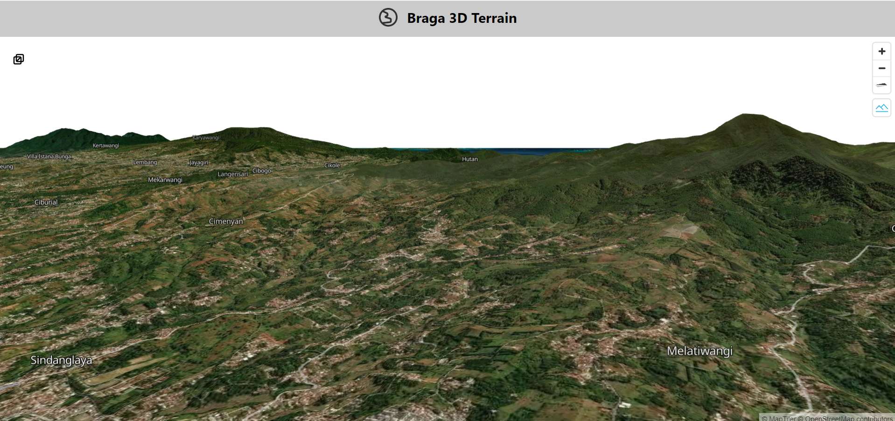
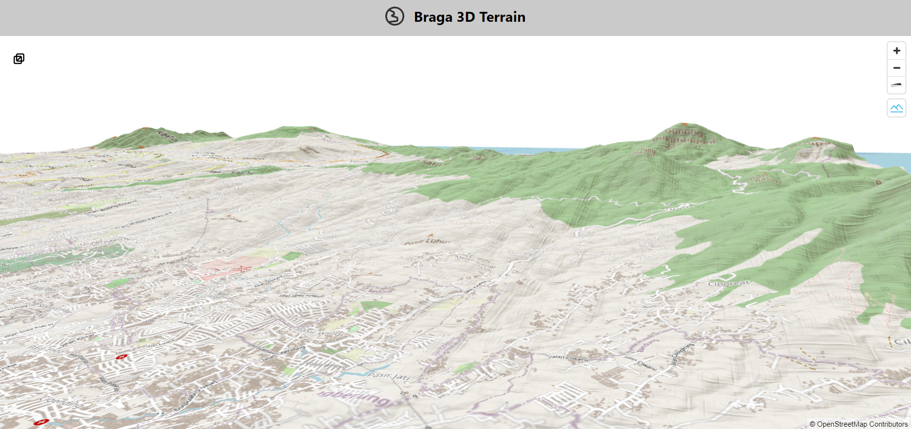

# Web-apps : 3D Terrain

## Description

This web application utilizes pnpm for the package manager, to initiate this platform there are two steps to follow.

1. pnpm install
2. pnpm run dev

 

### How to

In this frontend section there are layer switcher, navigate button, and 3d switcher. The 3d terrain comes with two option, plain OSM and satellite imagery. To change or add other terrain data, there are some steps needed to be done. As follows:

1. Convert DEM to EPSG:3857
2. Run the Rio-RGBify
3. Move the raster tiles into Data folder
4. Add proxy setting to change the target in vite.config
5. Change the route for raster-dem source in the Map.jsx file

## Visualization

